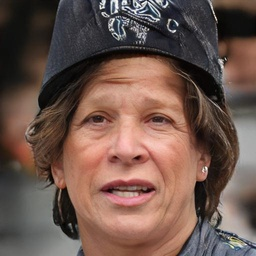
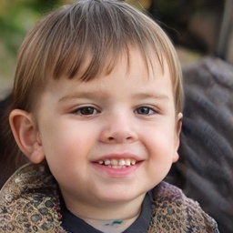
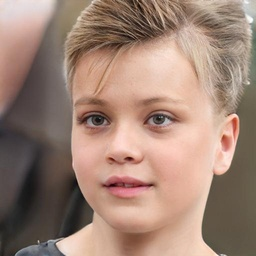
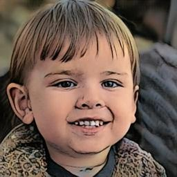
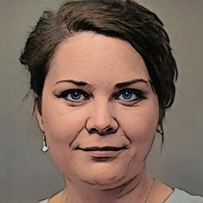
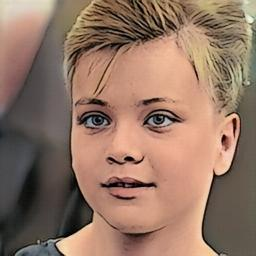

# CycleGAN Image Translation Project

Полнофункциональная реализация CycleGAN для преобразования изображений между двумя доменами с поддержкой обучения, тестирования, инференса и Telegram-бота.

## Примеры преобразования

<table>
  <tr><td colspan="6">Исходные изображения</td></tr>
  <tr>
    <td></td>
    <td></td>
    <td></td>
    <td></td>
    <td></td>
    <td></td>
  </tr>
  <tr><td colspan="6">Результат преобразования</td></tr>
  <tr>
    <td></td>
    <td></td>
    <td></td>
    <td></td>
    <td></td>
    <td></td>
  </tr>
</table>

## Особенности

* Полный цикл ML: обучение → тестирование → инференс → развертывание

* Многомодульная архитектура: чистый и поддерживаемый код

* Поддержка TensorBoard: визуализация обучения в реальном времени

* Telegram-бот: удобный интерфейс через Telegram

* Web-интерфейсы: Streamlit и Flask API

* Пакетная обработка: обработка целых директорий изображений

* Комплексное тестирование: метрики качества (PSNR, SSIM, FID)

* Прогресс-бар: визуализация процесса обучения

## Архитектура проекта
```
text

cyclegan_project/
├── config.py              # Конфигурация всех параметров
├── data_loader.py         # Загрузка и обработка данных
├── models.py              # Архитектуры генераторов и дискриминаторов
├── train.py              # Логика обучения с TensorBoard
├── test.py               # Комплексное тестирование моделей
├── inference.py          # Инференс и веб-интерфейсы
├── telegram_bot.py       # Telegram-бот
├── streamlit_app.py      # Web-интерфейс на Streamlit
├── utils.py              # Вспомогательные функции
├── main.py              # Основной CLI интерфейс
├── requirements.txt      # Зависимости
├── .env                 # Конфигурация окружения (токены)
└── README.md            # Эта документация
```
## Установка

### 1. Клонирование репозитория
```
bash

git clone https://github.com/dprotasovitsky/ds2_belhard.git
cd cyclegan-project
```

### 2. Создание виртуального окружения
```
bash

# Windows
python -m venv venv
venv\Scripts\activate

# Linux/Mac
python3 -m venv venv
source venv/bin/activate
```
### 3. Установка зависимостей
```
bash

# Минимальные зависимости
pip install torch torchvision pillow numpy

# Полная установка
pip install -r requirements.txt

# Или выборочная установка
pip install torch torchvision tensorboard tqdm matplotlib
pip install python-telegram-bot python-dotenv  # Для Telegram бота
pip install streamlit flask                    # Для веб-интерфейсов
```
### 4. Подготовка данных
```
bash

# Создание структуры директорий
mkdir -p datasets/photo2comics/trainA
mkdir -p datasets/photo2comics/trainB
mkdir -p datasets/photo2comics/testA
mkdir -p datasets/photo2comics/testB
mkdir -p checkpoints
mkdir -p logs
mkdir -p example_images
mkdir -p inference_outputs

# Для датасета photo2comics (пример)
# Поместите изображения лица людей в datasets/photo2comics/trainA/
# Поместите изображения лица комикса в datasets/photo2comics/trainB/
# Поместите изображения лица людей в datasets/photo2comics/testA/
# Поместите изображения лица комикса в datasets/photo2comics/testB/
```
## Использование
### Обучение
```
bash

# Базовое обучение
python main.py --mode train --epochs 100 --batch-size 4

# С кастомными параметрами
python main.py --mode train \
    --epochs 200 \
    --batch-size 8 \
    --dataset path/to/dataset \
    --log-dir logs/my_experiment

# Продолжение обучения с чекпоинта
python main.py --mode train \
    --checkpoint checkpoints/cyclegan_best.pth \
    --epochs 50
```
### Тестирование
```
bash

# Комплексное тестирование
python main.py --mode test \
    --checkpoint checkpoints/cyclegan_best.pth

# Тестирование одного батча
python main.py --mode test \
    --checkpoint checkpoints/cyclegan_best.pth \
    --single-batch

# Тестирование с ограничением выборки
python main.py --mode test \
    --checkpoint checkpoints/cyclegan_best.pth \
    --num-samples 50
```
### Инференс
```
bash

# Преобразование одного изображения
python main.py --mode inference \
    --checkpoint checkpoints/cyclegan_best.pth \
    --image-path input.jpg \
    --direction A_to_B

# Пакетная обработка директории
python main.py --mode inference \
    --checkpoint checkpoints/cyclegan_best.pth \
    --input-dir example_images/ \
    --output-dir test_results/ \
    --direction B_to_A

# Циклическое преобразование
python main.py --mode inference \
    --checkpoint checkpoints/cyclegan_best.pth \
    --image-path input.jpg \
    --direction cycle
```
### Telegram Бот
```
bash

# 1. Получите токен бота у @BotFather
# 2. Создайте .env файл
python main.py --create-env
# Отредактируйте .env, добавьте ваш токен

# 3. Запустите бота
python main.py --mode inference \
    --checkpoint checkpoints/cyclegan_best.pth \
    --web-interface telegram

# Или напрямую
python telegram_bot.py --token ВАШ_ТОКЕН
```
### Web Интерфейсы
### Streamlit
```
bash

# Запуск Streamlit приложения
python main.py --mode inference \
    --checkpoint checkpoints/cyclegan_best.pth \
    --web-interface streamlit \
    --port 8501

# Или напрямую
streamlit run streamlit_app.py
```
### Flask API
```
bash

# Запуск REST API
python main.py --mode inference \
    --checkpoint checkpoints/cyclegan_best.pth \
    --web-interface api \
    --port 8080

# Пример использования API
curl -X POST -F "image=@input.jpg" \
    -F "direction=A_to_B" \
    http://localhost:8080/transform \
    --output result.png
```
### Структура проекта
```
text

project/
├── checkpoints/          # Сохраненные модели
├── datasets/             # Датасеты
│   └── photo2comics/     # Пример датасета
│       ├── trainA/      # Изображения домена A
│       ├── trainB/      # Изображения домена B
│       ├── testA/       # Тестовые изображения A
│       └── testB/       # Тестовые изображения B
├── logs/                # Логи TensorBoard
├── inference_outputs/   # Результаты инференса
├── example_images/      # Примеры изображений
├── telegram_temp/       # Временные файлы Telegram бота
└── test_results/        # Результаты тестирования
```
## Конфигурация
### Основные параметры (config.py)
```
python

# Данные
dataset_path = "datasets/photo2comics"
image_size = 256

# Обучение
batch_size = 1
num_epochs = 200
lr = 0.0002

# Модель
num_residual_blocks = 9
lambda_cycle = 10.0
lambda_identity = 0.5

# Логирование
log_interval = 50
sample_interval = 200
checkpoint_interval = 10
```
### Telegram Bot (.env файл)
```
env

TELEGRAM_BOT_TOKEN=your_token_here
TELEGRAM_ADMIN_IDS=123456789,987654321
TELEGRAM_MAX_IMAGE_SIZE=10485760
TELEGRAM_MODELS_DIR=checkpoints
TELEGRAM_DEFAULT_IMAGE_SIZE=256
```
## Примеры использования
### 1. Обучение модели
```
bash

# Обучение на датасете photo2comics
python main.py --mode train \
    --dataset datasets/photo2comics \
    --epochs 200 \
    --batch-size 4 \
    --log-dir logs/photo2comics_experiment

# Мониторинг обучения
tensorboard --logdir logs/photo2comics_experiment
```
### 2. Telegram бот
```
text

Пользователь: /start
Бот: Привет! Я бот для преобразования изображений...

Пользователь: /models
Бот: [Кнопки: cyclegan_best, cyclegan_final]

Пользователь: [Выбирает cyclegan_best]
Бот: Модель выбрана

Пользователь: /direction
Бот: [Кнопки: A → B, B → A]

Пользователь: [Выбирает A → B]
Бот: Направление выбрано

Пользователь: [Отправляет изображение лица человека]
Бот: Обработка...
Бот: Преобразование завершено!
```
### 3. REST API
```
python

import requests

# Отправка изображения на преобразование
response = requests.post(
    "http://localhost:8080/transform",
    files={"image": open("input.jpg", "rb")},
    data={"direction": "A_to_B"}
)

# Сохранение результата
with open("output.png", "wb") as f:
    f.write(response.content)
```
## Тестирование и метрики

Проект включает комплексное тестирование с вычислением:

   * PSNR (Peak Signal-to-Noise Ratio) - качество реконструкции

   * SSIM (Structural Similarity Index) - структурное сходство

   * MSE (Mean Squared Error) - среднеквадратичная ошибка

   * FID (Fréchet Inception Distance) - качество генерации
```
bash

# Запуск тестирования
python main.py --mode test \
    --checkpoint checkpoints/cyclegan_best.pth

# Результаты сохраняются в test_results/
# - metrics.csv - таблица метрик
# - plots/ - графики распределения
# - images/ - примеры преобразований
```
## Требования

* Python 3.8+

* PyTorch 1.9+

* CUDA (опционально, для GPU ускорения)

* 8GB+ RAM (рекомендуется)

* 2GB+ свободного места на диске